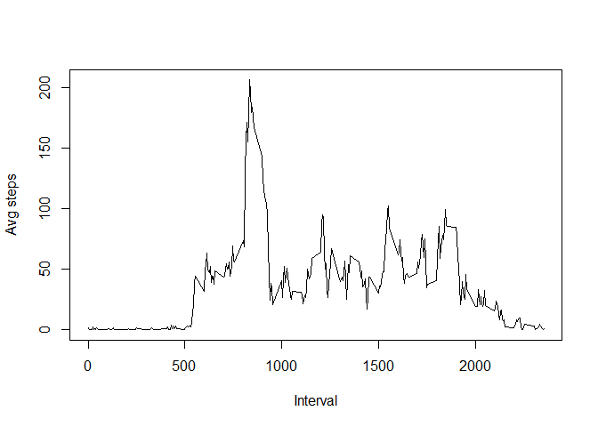
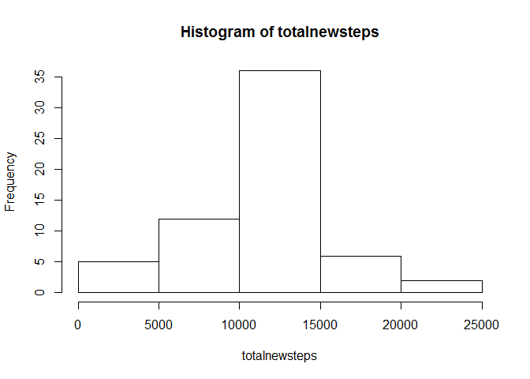

# Reproducible Research: Peer Assessment 1


## Loading and preprocessing the data
1. Load the data into R

```r
setwd("D:/eCourses/05_ReproducibleResearch/CourseProject1/Repdata_PeerAssessment1")
steps <- read.csv("activity.csv", header = TRUE)
```
2. Transform data into a format suitable for analysis

```r
##transform date variable from factor to date (POSIXct) class 
library(lubridate)
steps$date <- ymd(steps$date)
```

## What is mean total number of steps taken per day?
1. Make a histogram of the total number of steps taken each day

```r
totalsteps <- tapply(steps$steps, steps$date, sum)
##note that using rm.na at this step will change NA to 0 and thus days
##with all NA values for steps will be incorrectly scored as 0 steps per day
hist(totalsteps)
```

 

2. Calculate and report the mean and median total number of steps per day

```r
avgsteps <- mean(totalsteps, na.rm = TRUE)
print(paste0("Mean steps per day = ", avgsteps))
```

```
## [1] "Mean steps per day = 10766.1886792453"
```

```r
mediansteps <- median(totalsteps, na.rm = TRUE)
print(paste0("Median steps per day = ", mediansteps))
```

```
## [1] "Median steps per day = 10765"
```

## What is the average daily activity pattern?
1. Make a time series plot of the 5-minute intervals and the average number of steps taken, averaged across all days.

```r
intervalsteps <- tapply(steps$steps, steps$interval, mean, na.rm = TRUE)
intervals <- unique(steps$interval)
intervaldata <- as.data.frame(cbind(intervals, intervalsteps))
```

```r
plot(intervaldata$intervals, intervaldata$intervalsteps, type = "l", 
     xlab = "Interval", ylab = "Avg steps")
```

 

```r
##The question asked for intervals on the x-axis rather than time
##so there is a gap every hour, in this case every 100 
##intervals. For example, the time between 0855 and 0900 
##is interpreted as 45 intervals not one 5-minute interval.
```

2. Which 5-minute interval, on average across all the days in the dataset, 
contains the maximum number of steps?

```r
maxstepinterval <- intervaldata[which.max(intervaldata$intervalsteps), 1]
print(paste0("Interval with highest mean steps per day = ", maxstepinterval))
```

```
## [1] "Interval with highest mean steps per day = 835"
```
## Imputing missing values
1. Calculate and report the total number of missing values in the dataset

```r
colSums(is.na(steps))
```

```
##    steps     date interval 
##     2304        0        0
```

2. Fill missing values with corresponding average for that interval across all days


```r
##add new column for avg steps per interval throughout dataset
##this makes the next for/if loop easier
steps$avgstepsint <- intervalsteps

##copy values from steps column to newsteps column or replace if NA
for (i in 1:nrow(steps)){
      if (is.na(steps$steps[i])){
        steps$newsteps[i] <- steps$avgstepsint[i]
      }   
      else {
        steps$newsteps[i] <- steps$steps[i]    
      }
}
```
3. Create a new dataset that is equal to the original dataset but with the missing data filled in.

The data set steps now has a new variable, newsteps, that has the missing data filled in.


4a. Make a histogram of the total number of steps taken each day 

```r
totalnewsteps <- tapply(steps$newsteps, steps$date, sum)
hist(totalnewsteps)
```

 

4b. Calculate and report the mean and median total number of steps taken per day. 

```r
avgnewsteps <- mean(totalnewsteps)
print(paste0("Mean steps per day using filled in data = ", avgnewsteps))
```

```
## [1] "Mean steps per day using filled in data = 10766.1886792453"
```

```r
mediannewsteps <- median(totalnewsteps)
print(paste0("Median steps per day using filled in data = ", mediannewsteps))
```

```
## [1] "Median steps per day using filled in data = 10766.1886792453"
```

4c. Do these values differ from the estimates from the first part of the assignment? 

Using the inteval means to replace missing values resulted in essentially no change to the mean and very little change to the median.  

4d. What is the impact of imputing missing data on the estimates of the total daily number of steps?

In this case the impact was negligible. Only a few days had missing values so replacing those values with the means calculated from all the other days had little effect. If many of the days had missing values then replacing those with the means from just a few days may have a larger impact. In terms of the histograms, using the filled in data essentially adds the days with NAs to the middle bar (the mode)

## Are there differences in activity patterns between weekdays and weekends?

1. Create a new factor variable in the dataset with two levels - indicating whether a given date is a weekday or weekend day.

```r
steps$day <- as.factor(weekdays(steps$date))
for (i in 1:nrow(steps)){
  if (steps$day[i] == "Sunday"){
    steps$weekday[i] <- "weekend"
  } 
  else if (steps$day[i] == "Saturday"){
    steps$weekday[i] <- "weekend"
  }
  else {steps$weekday[i] <- "weekday"}
}
##convert new variable to factor
steps$weekday <- as.factor(steps$weekday)
```

2. Make a panel plot containing a time series plot of the 5-minute intervals and the average number of steps taken, averaged across all weekday days or weekend days.

```r
library(dplyr)
```

```
## 
## Attaching package: 'dplyr'
## 
## The following objects are masked from 'package:lubridate':
## 
##     intersect, setdiff, union
## 
## The following object is masked from 'package:stats':
## 
##     filter
## 
## The following objects are masked from 'package:base':
## 
##     intersect, setdiff, setequal, union
```

```r
weekdaysteps <- filter(steps, weekday == "weekday")
weekendsteps <- filter(steps, weekday == "weekend")
westeps <- tapply(weekendsteps$newsteps, weekendsteps$interval, mean)
wdsteps <- tapply(weekdaysteps$newsteps, weekdaysteps$interval, mean)
##the four steps above filter out the steps from weekdays and weekends
##then gets the means for each interval

plotdata1 <- as.data.frame(cbind(intervals, wdsteps))
plotdata1$day <- as.factor("weekday")
plotdata1 <- rename(plotdata1, avgsteps = wdsteps)

plotdata2 <- as.data.frame(cbind(intervals, westeps))
plotdata2$day <- as.factor("weekend")
plotdata2 <- rename(plotdata2, avgsteps = westeps)

plotdata <- rbind(plotdata1, plotdata2)
##the seven steps above build a new dataframe for making the graph
##first adding the intervals, then a new variable for day (weekday or weekend)
##then renaming the steps variable the same in both in preparation for 
##rbind in the last step

##this code (above) is clunky, there must be a better, more streamlined way to 
##do this with something from apply , dplyr, and/or aggregate
##suggestions from reviewers are welcome
```


```r
library(lattice)
xyplot(avgsteps ~ intervals | day, type = "l", data = plotdata, 
       xlab = "Interval",
       ylab = "Number of steps",
       layout = c(1,2))
```

 


The main differences in activity patterns between weekdays and weekend days are:

1. activity starts earlier on weekdays
2. weekdays have a pronouced peak in the morning (at about 8:35 AM) and then relatively low activity throughout the day, slightly more in the afternoon and evening.
3. weekend activity starts later in the morning, still has a peak between 8:00 and 9:00 AM, and then is more active throughout the day compared to weekdays.
4. weekends have slightly higher activity in the late evening (after about 8:00 PM) compared to weekdays.

